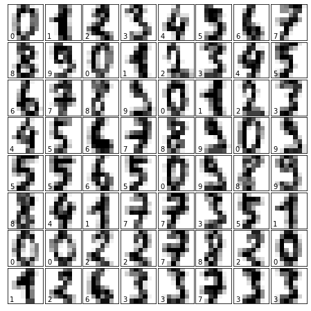
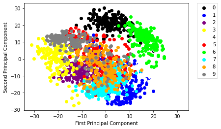
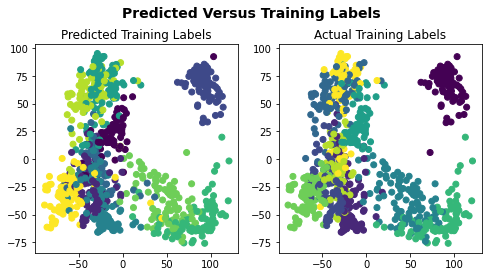
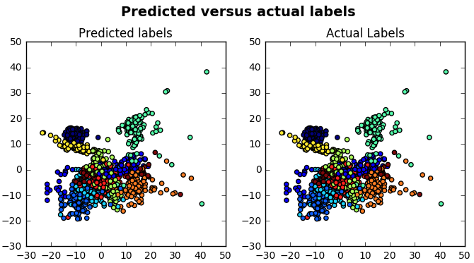

# Machine Recognition of Handwritten Numbers

## 1. Introduction

### 1.1. Business Problem

Currently, there are processes that, to be valid or authenticated, have to be handwritten. Most of these manuscripts can only be recognized by a human being or by very few applications, so the need to process information of this nature is merely existent. That is why it is important to work with a program that allows the manuscripts to be processed and interpreted by a machine in order to obtain a substantial saving of resources in terms of money and time.

### 1.2. Interest

The application of this model will be of interest to multiple sectors. For example, in the case of the financial sector, it may be applied for the recognition of the values of handwritten checks. As for accounting, books that have not been digitized can now be digitized thanks to this model. On the other hand, when it comes to grading systems at the educational level, subject exams that involve numbers, such as mathematics, physics or chemistry, may be more easily corrected due to this facility.

## 2. Data Acquisition and Exploration

### 2.1. Data Source

The data was extracted normalized bitmaps of handwritten digits from a preprinted form. From a total of 43 people, 30 contributed to the training set and different 13 to the test set. 32x32 bitmaps are divided into non overlapping blocks of 4x4 and the number of on pixels are counted in each block. This generates an input matrix of 8x8 where each element is an integer in the range 0..16. This reduces dimensionality and gives invariance to small distortions. 

Attribute Information:

All input attributes are integers in the range 0..16.
The last attribute is the class code 0..9

[Source](https://archive.ics.uci.edu/ml/datasets/optical+recognition+of+handwritten+digits)

### 2.2. Data Analysis

There are 1797 samples and that there are 64 features. Because you have 1797 samples, you also have 1797 target values.

But all those target values contain 10 unique values, namely, from 0 to 9. In other words, all 1797 target values are made up of numbers that lie between 0 and 9. This means that the digits that your model will need to recognize are numbers from 0 to 9.

Lastly, the images data contains three dimensions: there are 1797 instances that are 8 by 8 pixels big. You can visually check that the images and the data are related by reshaping the images array to two dimensions: digits.images.reshape((1797, 64)).

### 2.3 Principal Component Analysis (PCA)¶

As the digits data set contains 64 features is necessary to apply one of the Dimensionality Reduction techniques, namely Principal Component Analysis (PCA). The idea in PCA is to find a linear combination of the two variables that contains most of the information. This new variable or “principal component” can replace the two original variables.

### 2.4. Data Preparation

The data needs to be normalized in order to shift the distribution of each attribute to have a mean of zero and a standard deviation of one (unit variance). The approach here is to take 2/3 of the original data set as the training set, while the 1/3 that remains will compose the test set. Also note that the argument random_state has the value 42 assigned to it. With this argument, the split will always be the same.

## 3. Modeling

### 3.1. K-means

For this model, the initial k value was set at 10. Also, the init paramater is used to default to ‘k-means++’.

At first sight, the visualization doesn’t seem to indicate that the model works well.

|inertia | homo  | compl | v-meas | ARI     | AMI   | silhouette |
|--------|-------|-------|--------|---------|-------|------------|
|54173   | 0.557 | 0.633 | 0.593  |  0.401  | 0.576 |  0.118     |

- The homogeneity score tells you to what extent all of the clusters contain only data points which are members of a single class.
- The completeness score measures the extent to which all of the data points that are members of a given class are also elements of the same cluster.
- The V-measure score is the harmonic mean between homogeneity and completeness.
- The adjusted Rand score measures the similarity between two clusterings and considers all pairs of samples and counting pairs that are assigned in the same or different clusters in the predicted and true clusterings.
- The Adjusted Mutual Info (AMI) score is used to compare clusters. It measures the similarity between the data points that are in the clusterings, accounting for chance groupings and takes a maximum value of 1 when clusterings are equivalent.
- The silhouette score measures how similar an object is to its own cluster compared to other clusters. The silhouette scores range from -1 to 1, where a higher value indicates that the object is better matched to its own cluster and worse matched to neighboring clusters. If many points have a high value, the clustering configuration is good.

### 3.1. Support Vector Machine

For this model the paramaters selected were 0.001 for gamma, linear for kernel and 100 for regularization. For finding the best parameters grid search was used. The following values were the output of Grid Search for the best parameters to use:

|Best score for training data | 0.9866480446927375
|Best `C` | 10
|Best kernel | rbf
|Best `gamma` | 0.001

We can see that this model performs better than k-means, as it can be appreciated in the following figure, which shows a better prediction accuracy.

## 4. Conclusion

- The accuracy of the SVM model is really high (0.98), but other models should be tested as well.
- The data source have as limitation that only contains numbers, so for future work is recommended to search for a dataset that contains also characters and symbols.
- The applications for the model created goes from automating the check collection at a bank to automating exams gradings, for example.
